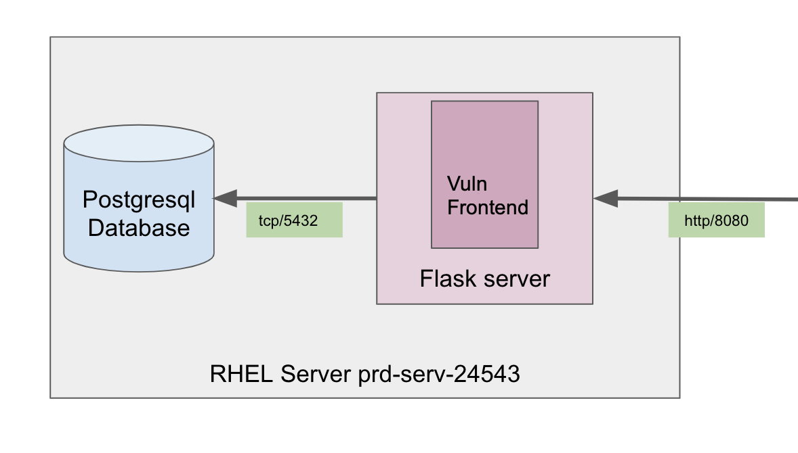

##Scenario 3
### Context ###
A product team wants to deploy a new service on the LAN.
While they are developing the first version, they ask you to have a look at their code and provide advice in order to improve the security of this application.
The dev team provide and archive of their source code and a basic schema to have a better understanding on how they plan to deploy it in production.

### Expected result ###
There is at least 15 major issues. They can be categorized in:
 - Source code
 - Architecture
 - Devops practices

We expect you to identify:
 - the most critical vulnerabilities
 - at least 1 vulnerability per category
 
For each vulnerability you should document:
 - The problem location
 - The impact on the application
 - A proposition on how to fix it
 - How you've identified it

We also expect you explain what as been your approach in order to run this analysis.

Good luck !
